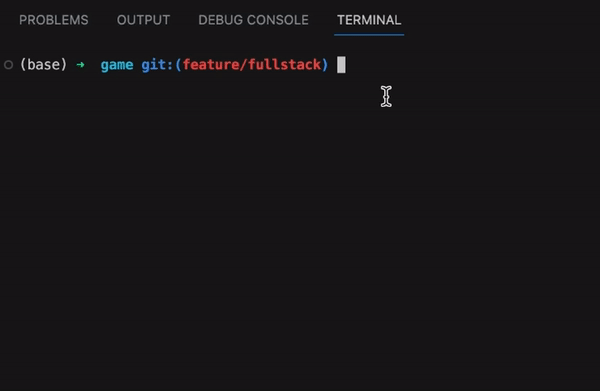
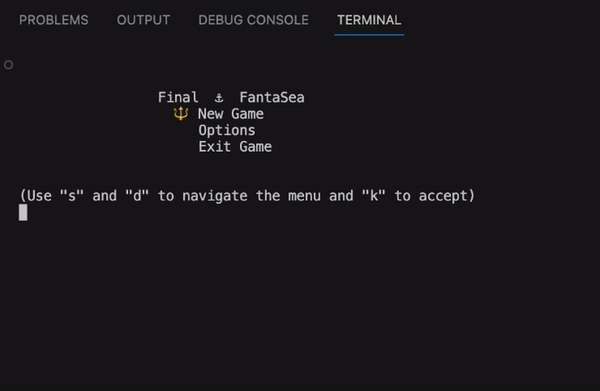

# Final FantaSea
## My first ever developed video game, a tribute to the classic combat system of Final Fantasy, tailored for a simplified playthrough experience exclusively through the command line. Developed using JavaScript and Node.js, this homage allows players to engage in the immersive world of Final FantaSea's combat mechanics directly through the console interface.

### Demo
#### Initialization and game info

#### Defeat

#### Victory and exiting game

### How to play
- Download game folder
- Open index.mjs and update the logBook.txt file path (This saves all session info and battle reports)
- On the console navigate to game folder
- Run `node index.mjs`
- Play the game using "s" and "w" as down and up arrows respectively and "k" as accept key
- Enjoy!

### Future updates
- More classes with special attacks or abilities
- More enemies, maybe even multiple enemy fights
- Character selection screen
- Multiple round games
- And more!